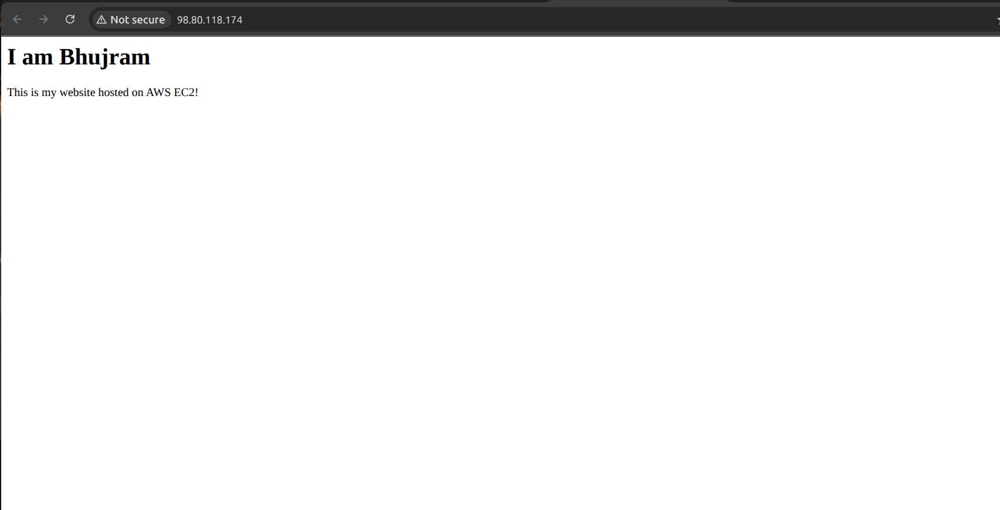
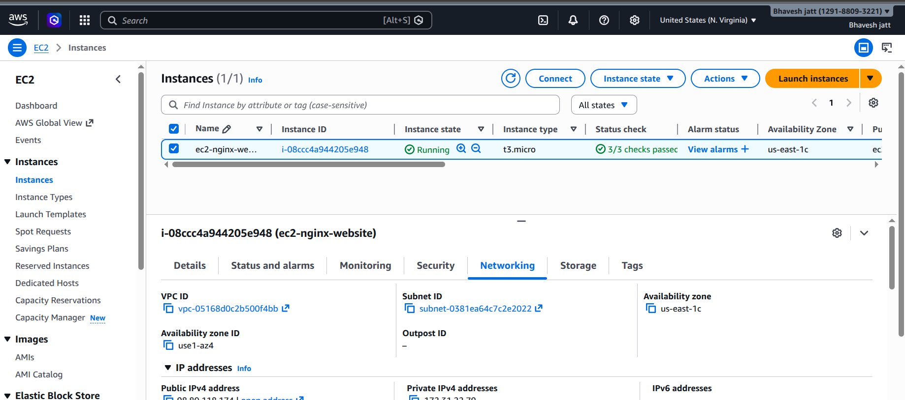
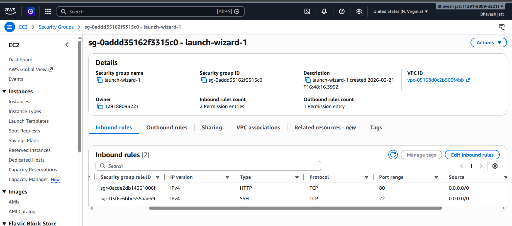

# EC2 Nginx Static Website Hosting

## What I Did
Hosted a static website on AWS EC2 using Nginx web server.

## Steps Followed
1. Launched EC2 instance (Ubuntu) on AWS
2. Opened port 80 (HTTP) and port 22 (SSH) in Security Group
3. Connected to EC2 via SSH
4. Installed Nginx manually
5. Created custom HTML file at /var/www/html/index.html
6. Accessed website using EC2 Public IP in browser

## Tech Used
- AWS EC2
- Nginx
- Linux (Ubuntu)
- HTML

## Result
Website successfully hosted and accessible via EC2 public IP.

## Screenshots

### Website Live

## Project Structure

ec2-nginx-static-website/
├── index.html          # Main website HTML file
├── userdata.sh         # Automation script for EC2 setup
└── README.md           # Project documentation

## Architecture

+------------------+
|   User/Browser   |
+------------------+
         |
         | HTTP Request (Port 80)
         ↓
+------------------+
|   AWS EC2        |
|  (Ubuntu Server) |
|                  |
|  +------------+  |
|  |   Nginx    |  |
|  | Web Server |  |
|  +------------+  |
|         |        |
|  +------------+  |
|  | index.html |  |
|  +------------+  |
+------------------+
         |
         | HTTP Response
         ↓
+------------------+
|  Website Loads   |
|  in Browser  ✅  |
+------------------+

### EC2 Instance Running

### Security Group

